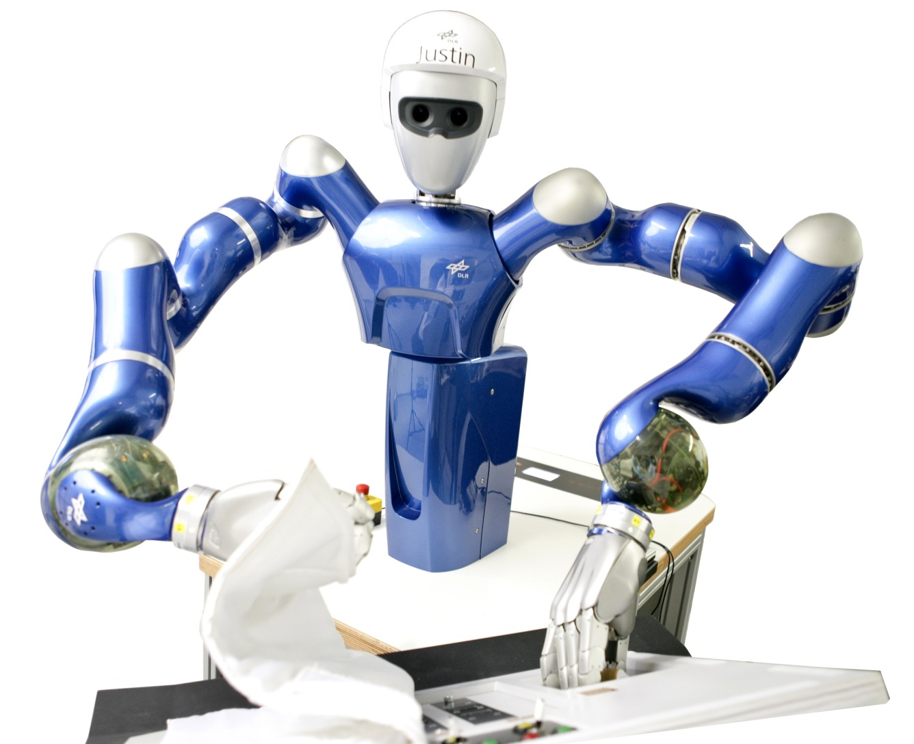

# Mikel Sagardia - Project Portfolio

This repository compiles links to some of the projects I have worked on or I am currently working on:

- :mortar_board: [Some Public Research Projects](#some-public-research-projects)
- :soccer: [Some Side Projects](#some-side-projects)
- :books: [Some of My Guides on AI MOOCs and Books](#some-of-my-guides-on-ai-moocs-and-books)
- :space_invader: [Other Projects](#other-projects)
- :mailbox: [Contact and Other Information](#contact-and-other-information)

## Some Public Research Projects

<table>
<tr>
    <td width=500>
        Realtime Collision Avoidance for Robots with Arbitrary Geometries
    </td>
    <td width=100>
        <a href="https://youtu.be/OqWwkPrrcII">Video</a>,
        <a href="https://ieeexplore.ieee.org/document/8446527">Paper</a>
    </td>
    <td width=250>
        

            
        

    </td>
</tr>
<tr>
    <td>
        A Platform for Bimanual Virtual Assembly Training with Haptic Feedback in Large Multi-Object Environments
    </td>
    <td>
        <a href="https://youtu.be/marxNRb4e-c">Video</a>,
        <a href="https://dl.acm.org/doi/10.1145/2993369.2993386">Paper</a>
    </td>
    <td>
        

            
        

    </td>
</tr>
<tr>
    <td width=180>
        VR-OOS: The DLR’s Virtual Reality Simulator for Telerobotic On-Orbit Servicing With Haptic Feedback
    </td>
    <td width=40>
        <a href="https://youtu.be/D9Jbew5Zmpw">Video</a>,
        <a href="https://ieeexplore.ieee.org/document/7119040">Paper</a>
    </td>
    <td>
        

            
        

    </td>
</tr>
<tr>
    <td width=180>
        Realtime Physics Simulations with Fast and Robust Collision Detection and Force Computation Integrated to Bullet
    </td>
    <td width=40>
        <a href="https://youtu.be/Fsb0f1t4IbE">Video</a>,
        <a href="https://diglib.eg.org/handle/10.2312/eurovr.20141341.065-076">Paper</a>
    </td>
    <td>
        

            
        

    </td>
</tr>
<tr>
    <td width=180>
        Multimodal Evaluation of the Differences between Real and Virtual Assemblies
    </td>
    <td width=40>
        <a href="https://youtu.be/En_IXwSNVco">Video</a>,
        <a href="https://ieeexplore.ieee.org/document/8013101">Paper</a>
    </td>
    <td>
        

            
        

    </td>
</tr>
<tr>
    <td width=180>
        Ultrapiano: A Novel Human-Machine Interface Applied to Virtual Reality
    </td>
    <td width=40>
        <a href="https://youtu.be/1yoU1f_zwiY">Video</a>,
        <a href="https://ieeexplore.ieee.org/document/6907142">Paper</a>
    </td>
    <td>
        

            
        

    </td>
</tr>
<tr>
    <td width=180>
        Narrow Passage Sampling in the Observation of Robotic Assembly Tasks
    </td>
    <td width=40>
        <a href="https://ieeexplore.ieee.org/abstract/document/7487125">Paper</a>
    </td>
    <td>
        

            
        

    </td>
</tr>
<tr>
    <td width=160>
        My PhD Thesis: <em>Virtual Manipulations with Force Feedback in Complex Interaction Scenarios</em>
    </td>
    <td width=40>
        <a href="https://mediatum.ub.tum.de/?id=1463136">Dissertation</a>
    </td>
    <td>
        

            
        

    </td>
</tr>
</table>

<!--
- Realtime Collision Avoidance for Robots with Arbitrary Geometries: [Video](https://youtu.be/OqWwkPrrcII) | [Paper](https://ieeexplore.ieee.org/document/8446527).
- A Platform for Bimanual Virtual Assembly Training with Haptic Feedback in Large Multi-Object Environments: [Video](https://youtu.be/marxNRb4e-c) | [Paper](https://dl.acm.org/doi/10.1145/2993369.2993386).
- VR-OOS: The DLR’s Virtual Reality Simulator for Telerobotic On-Orbit Servicing With Haptic Feedback: [Video](https://youtu.be/D9Jbew5Zmpw) | [Paper](https://ieeexplore.ieee.org/document/7119040).
- Realtime Physics Simulations with Fast and Robust Collision Detection and Force Computation Integrated to Bullet: [Video](https://youtu.be/Fsb0f1t4IbE) | [Paper](https://diglib.eg.org/handle/10.2312/eurovr.20141341.065-076).
- Multimodal Evaluation of the Differences between Real and Virtual Assemblies: [Video](https://youtu.be/En_IXwSNVco) | [Paper](https://ieeexplore.ieee.org/document/8013101).
- Ultrapiano: A Novel Human-Machine Interface Applied to Virtual Reality: [Video](https://youtu.be/1yoU1f_zwiY) | [Paper](https://ieeexplore.ieee.org/document/6907142).
- Narrow Passage Sampling in the Observation of Robotic Assembly Tasks: [Paper](https://ieeexplore.ieee.org/abstract/document/7487125).
- My PhD Thesis: *Virtual Manipulations with Force Feedback in Complex Interaction Scenarios* : [Dissertation](https://mediatum.ub.tum.de/?id=1463136).
-->

## Some Side Projects

Please, note that these are some of my *side* projects, which might or might not be finished; in any case, the project status should be reported in each project page.

| Topic / Project | Link | Type of Data | Methods | Tools |
|---|---|---|---|---|
| Face Generation with a Convolutional Generative Adversarial Network (GAN) | [Github](https://github.com/mxagar/face_generator_gan) | Images :city_sunrise: | GAN, CNN | Pytorch |
| Image Captioning: Image Description Text Generator Combining CNNs and RNNs | [Github](https://github.com/mxagar/image_captioning) | Images :city_sunrise:, Text :page_facing_up: | CNN, RNN, Image Captioning | Pytorch |
| Facial Keypoint Detection with Deep Convolutional Neural Networks (CNNs) | [Github](https://github.com/mxagar/P1_Facial_Keypoints) | Images :city_sunrise: | CNN, Regression | Pytorch |
| Skin Cancer Detection with Convolutional Neural Networks (CNNs) and T-SNE Visualization of Compressed Image Representations | [Github](https://github.com/mxagar/dermatologist-ai) | Images :city_sunrise: | CNN, Classification, Autoencoders, Manifold Learning | Pytorch, Scikit-Learn |
| Dog Breed Classification with Convolutional Neural Networks (CNNs) and Transfer Learning | [Github](https://github.com/mxagar/deep-learning-v2-pytorch/tree/master/project-dog-classification) | Images :city_sunrise: | CNN, Classification, Transfer Learning | Pytorch |
| American Sign Language (ASL) Image Analysis and Classification with Convolutional Neural Networks (CNNs) | [Github](https://github.com/mxagar/asl_alphabet_image_classification) | Images :city_sunrise: | CNN, Classification, Transfer Learning, Autoencoders | Tensorflow/Keras |
| Analysis and Modelling of the AirBnB Dataset from the Basque Country | [Blog](https://mikelsagardia.io/blog/airbnb-spain-basque-data-analysis.html), [Github](https://github.com/mxagar/airbnb_data_analysis) | Tabular :bar_chart:, Text :page_facing_up: | Regression, Classification | Scikit-Learn |
| A Template Package to Transform Machine Learning Research Notebooks into *Production-Level* Code and Its Application to Predicting Customer Churn | [Blog](https://mikelsagardia.io/blog/machine-learning-production-level.html), [Github](https://github.com/mxagar/customer_churn_production) | Tabular :bar_chart: | MLOps, Classification, Clean Code | Python Packaging |
| A Boilerplate for Reproducible Machine Learning Pipelines with MLflow and Weights & Biases and Its Application to Song Genre Classification | [Github](https://github.com/mxagar/music_genre_classification) | Tabular :bar_chart: | MLOps, Classification, Random Forests | Scikit-Learn, MLflow, Weights & Biases |
| A Reproducible Machine Learning Pipeline for Short-Term Rental Price Prediction in New York City | [Github](https://github.com/mxagar/ml_pipeline_rental_prices) | Tabular :bar_chart: | MLOps, Regression | Scikit-Learn, MLflow, Weights & Biases |
| Deployment of a Sentiment Analysis Recurrent Neural Network (RNN) Using AWS SageMaker | [Github](https://github.com/mxagar/sentiment_rnn_aws_deployment) | Text :page_facing_up: | MLOps, RNN, Classification, Sentiment Analysis | AWS SageMaker, API Gateway, Lambda, Pytorch |
| Text Generation: TV Script Creation with a Recurrent Neural Network (RNN) | [Blog](https://mikelsagardia.io/blog/text-generation-rnn.html), [Github](https://github.com/mxagar/text_generator) | Text :page_facing_up: | RNN, Text Generation | Pytorch |
| Simultaneous Localization and Mapping (SLAM) in 2D Using a Graph-Based Approach | [Github](https://github.com/mxagar/slam_2d) | Tabular :bar_chart:, Spatio-Temporal  :robot: | SLAM | Numpy |
| Predicting Bike Sharing Patterns with Neural Networks Written from Scratch with Numpy | [Github](https://github.com/mxagar/deep-learning-v2-pytorch/tree/master/project-bikesharing) | Tabular :bar_chart: | MLP, Regression | Numpy |
| A 80/20 Guide for Exploratory Data Analysis, Data Cleaning and Feature Engineering | [Blog](https://mikelsagardia.io/blog/data-processing-guide.html), [Github](https://github.com/mxagar/eda_fe_summary) | Tabular :bar_chart:, Text :page_facing_up: | *Guide*: EDA, Regression, Classification, Unsupervised Learning, Pipelines | Scikit-Learn, Pandas, Matplotlib, etc. |
| Beyond Image Classification: Object Detection and Semantic Segmentation Examples with Pytorch | [Github](https://github.com/mxagar/detection_segmentation_pytorch) | Images :city_sunrise: | *Compilation*: Object Detection & Segmentation | Pytorch |
| Text Sentiment Analysis: A Collection of Notes and Example | [Github](https://github.com/mxagar/text_sentiment) | Text :page_facing_up: | *Compilation*: Sentiment Analysis | Pytorch |

<!-- 
Text :page_facing_up: :page_facing_up:
Tabular :bar_chart: :bar_chart:
Images :city_sunrise: :city_sunrise: :city_sunrise:
Spatio-Temporal :robot:
-->
<!-- |  |  |  |  |  | -->
<!--
- Facial Keypoint Detection with Deep Convolutional Neural Networks (CNNs): [Github](https://github.com/mxagar/P1_Facial_Keypoints).
- Predicting Bike Sharing Patterns with Neural Networks Written from Scratch with Numpy: [Github](https://github.com/mxagar/deep-learning-v2-pytorch/tree/master/project-bikesharing).
- Analysis and Modelling of the AirBnB Dataset from the Basque Country: [Blog](https://mikelsagardia.io/blog/airbnb-spain-basque-data-analysis.html) | [Github](https://github.com/mxagar/airbnb_data_analysis).
- A 80/20 Guide for Exploratory Data Analysis, Data Cleaning and Feature Engineering: [Blog](https://mikelsagardia.io/blog/data-processing-guide.html) | [Github](https://github.com/mxagar/eda_fe_summary).
- A Template Package to Transform Machine Learning Research Notebooks into *Production-Level* Code and Its Application to Predicting Customer Churn: [Blog](https://mikelsagardia.io/blog/machine-learning-production-level.html) | [Github](https://github.com/mxagar/customer_churn_production).
- Dog Breed Classification with Convolutional Neural Networks (CNNs) and Transfer Learning: [Github](https://github.com/mxagar/deep-learning-v2-pytorch/tree/master/project-dog-classification).
- Skin Cancer Detection with Convolutional Neural Networks (CNNs) and T-SNE Visualization of Compressed Image Representations: [Github](https://github.com/mxagar/dermatologist-ai).
- A Boilerplate for Reproducible Machine Learning Pipelines with MLflow and Weights & Biases and Its Application to Song Genre Classification: [Github](https://github.com/mxagar/music_genre_classification).
- Beyond Image Classification: Object Detection and Semantic Segmentation Examples with Pytorch: [Github](https://github.com/mxagar/detection_segmentation_pytorch).
- Text Sentiment Analysis: A Collection of Notes and Examples: [Github](https://github.com/mxagar/text_sentiment).
- Text Generation: TV Script Creation with a Recurrent Neural Network (RNN): [Blog](https://mikelsagardia.io/blog/text-generation-rnn.html) | [Github](https://github.com/mxagar/text_generator).
- Image Captioning: Image Description Text Generator Combining CNNs and RNNs: [Github](https://github.com/mxagar/image_captioning).
- A Reproducible Machine Learning Pipeline for Short-Term Rental Price Prediction in New York City: [Github](https://github.com/mxagar/ml_pipeline_rental_prices).
- Face Generation with a Convolutional Generative Adversarial Network (GAN): [Github](https://github.com/mxagar/face_generator_gan).
- Simultaneous Localization and Mapping (SLAM) in 2D Using a Graph-Based Approach: [Github](https://github.com/mxagar/slam_2d).
- Deployment of a Sentiment Analysis Recurrent Neural Network (RNN) Using AWS SageMaker: [Github](https://github.com/mxagar/sentiment_rnn_aws_deployment).
- American Sign Language (ASL) Image Analysis and Classification with Convolutional Neural Networks (CNNs): [Github](https://github.com/mxagar/asl_alphabet_image_classification)
-->

## Some of My Guides on AI MOOCs and Books

This is a list of some repositories in which I collected notes for my future self while following courses/books. Note that in many cases the text is perfectly legible, but not edited; additionally, the original notes on a course/book might have been extended with other sources. For a complete list of the courses I have followed (with or without public notes), visit [my course compilation](https://github.com/mxagar/course_compilation).

| 
Course / Book + Link
  | 
My Notes | 
My Personal Rating |
| --- | --- | --- |
[Deep Learning Nanodegree, Udacity](https://www.udacity.com/course/deep-learning-nanodegree--nd101) | [Guide & Code](https://github.com/mxagar/deep_learning_udacity) | :star: :star: :star: :star: __ |
| [Computer Vision Nanodegree, Udacity](https://www.udacity.com/course/computer-vision-nanodegree--nd891) | [Guide & Code](https://github.com/mxagar/computer_vision_udacity) | :star: :star: :star: __ __ |
| [Data Science Nanodegree, Udacity](https://www.udacity.com/course/data-scientist-nanodegree--nd025) | [Guide & Code](https://github.com/mxagar/data_science_udacity) | :star: :star: :star: :star: __ |
| [Machine Learning DevOps Engineer Nanodegree, Udacity](https://www.udacity.com/course/machine-learning-dev-ops-engineer-nanodegree--nd0821) | [Guide & Code](https://github.com/mxagar/mlops_udacity) | :star: :star: :star: :star: :star: |
| [IBM Machine Learning Professional Certificate, Coursera / IBM](https://www.coursera.org/professional-certificates/ibm-machine-learning) | [Guide & Code](https://github.com/mxagar/machine_learning_ibm) | :star: :star: :star: :star: __ |
| [Machine Learning, Coursera / Univ. Standford](https://www.coursera.org/learn/machine-learning) | [Guide & Code](https://github.com/mxagar/machine_learning_coursera) | :star: :star: :star: :star: :star: |
| [Statistics with Python Specialization, Coursera / Uni. Michigan](https://www.coursera.org/specializations/statistics-with-python) | [Guide & Code](https://github.com/mxagar/statistics_with_python_coursera)  | :star: :star: :star: __ __ |
| [Accelerated Computer Science Fundamentals Specialization, Coursera / Univ. Illinois](https://www.coursera.org/specializations/cs-fundamentals) | [Guide & Code](https://github.com/mxagar/accelerated_computer_science_coursera) | :star: :star: :star: __ __ |
| [Machine Vision: Theory and Applications, Steger et al.](https://www.amazon.com/Machine-Vision-Algorithms-Applications-Carsten/dp/3527413650) | [Guide & Code](https://github.com/mxagar/machine_vision_notes) | :star: :star: :star: :star: :star: |
| [Notes on Manipulation Robotics, Craig](https://www.amazon.com/Introduction-Robotics-Mechanics-Control-4th/dp/0133489795/ref=sr_1_1?crid=2Q39F2ZXG1D2W&keywords=Introduction+to+Robotics&qid=1664796958&qu=eyJxc2MiOiIyLjYyIiwicXNhIjoiMi42OCIsInFzcCI6IjMuMDkifQ%3D%3D&sprefix=introduction+to+robotics%2Caps%2C144&sr=8-1) | [Guide](https://github.com/mxagar/robotics_notes) | :star: :star: :star: :star: __ |
| [Natural Language Processing (NLP) Guide, Udemy](https://www.udemy.com/course/nlp-natural-language-processing-with-python/) | [Guide & Code](https://github.com/mxagar/nlp_guide) | :star: :star: :star: :star: __ |
| [Notes on Reinforcement Learning, Udemy](https://www.udemy.com/course/practical-ai-with-python-and-reinforcement-learning/) | [Guide & Code](https://github.com/mxagar/data_science_python_tools/blob/main/24_ReinforcementLearning/ReinforcementLearning_Guide.md) | :star: :star: :star: __ __ |
| [SQL Guide, Udemy](https://www.udemy.com/course/the-complete-sql-bootcamp/) | [Guide & Code](https://github.com/mxagar/sql_guide) | :star: :star: :star: :star: __ |
| [Docker Guide, Udemy](https://www.udemy.com/course/docker-mastery/) | [Guide & Code](https://github.com/mxagar/templates/blob/master/docker_swarm_kubernetes/docker_swarm_kubernetes_howto.md) | :star: :star: :star: :star: __ |

<!--
- Deep Learning Nanodegree, Udacity: [Guide & Code](https://github.com/mxagar/deep_learning_udacity) | [Course Link](https://www.udacity.com/course/deep-learning-nanodegree--nd101) | :star: :star: :star: :star: __ 
- Computer Vision Nanodegree, Udacity: [Guide & Code](https://github.com/mxagar/computer_vision_udacity) | [Course Link](https://www.udacity.com/course/computer-vision-nanodegree--nd891) | :star: :star: :star: __ __
- Data Science Nanodegree, Udacity: [Guide & Code](https://github.com/mxagar/data_science_udacity) | [Course Link](https://www.udacity.com/course/data-scientist-nanodegree--nd025) | :star: :star: :star: :star: __
- Machine Learning DevOps Engineer Nanodegree, Udacity: [Guide & Code](https://github.com/mxagar/mlops_udacity) | [Course Link](https://www.udacity.com/course/machine-learning-dev-ops-engineer-nanodegree--nd0821) | :star: :star: :star: :star: :star:
- IBM Machine Learning Professional Certificate, Coursera / IBM: [Guide & Code](https://github.com/mxagar/machine_learning_ibm) | [Course Link](https://www.coursera.org/professional-certificates/ibm-machine-learning) | :star: :star: :star: :star: __
- Machine Learning, Coursera / Univ. Standford: [Guide & Code](https://github.com/mxagar/machine_learning_coursera) | [Course Link](https://www.coursera.org/learn/machine-learning) | :star: :star: :star: :star: :star:
- Statistics with Python Specialization, Coursera / Uni. Michigan: [Guide & Code](https://github.com/mxagar/statistics_with_python_coursera) | [Course Link](https://www.coursera.org/specializations/statistics-with-python) | :star: :star: :star: __ __
- Accelerated Computer Science Fundamentals Specialization, Coursera / Univ. Illinois: [Guide & Code](https://github.com/mxagar/accelerated_computer_science_coursera) | [Course Link](https://www.coursera.org/specializations/cs-fundamentals) | :star: :star: :star: __ __
- Machine Vision: Theory and Applications, Steger et al.: [Guide & Code](https://github.com/mxagar/machine_vision_notes) | [Book Link](https://www.amazon.com/Machine-Vision-Algorithms-Applications-Carsten/dp/3527413650) | :star: :star: :star: :star: :star:
- Notes on Manipulation Robotics, Craig: [Guide](https://github.com/mxagar/robotics_notes) | [Book Link](https://www.amazon.com/Introduction-Robotics-Mechanics-Control-4th/dp/0133489795/ref=sr_1_1?crid=2Q39F2ZXG1D2W&keywords=Introduction+to+Robotics&qid=1664796958&qu=eyJxc2MiOiIyLjYyIiwicXNhIjoiMi42OCIsInFzcCI6IjMuMDkifQ%3D%3D&sprefix=introduction+to+robotics%2Caps%2C144&sr=8-1) | :star: :star: :star: :star: __ 
- Natural Language Processing (NLP) Guide, Udemy: [Guide & Code](https://github.com/mxagar/nlp_guide) | [Course Link](https://www.udemy.com/course/nlp-natural-language-processing-with-python/) | :star: :star: :star: :star: __
- Notes on Reinforcement Learning, Udemy: [Guide & Code](https://github.com/mxagar/data_science_python_tools/blob/main/24_ReinforcementLearning/ReinforcementLearning_Guide.md) | [Course Link](https://www.udemy.com/course/practical-ai-with-python-and-reinforcement-learning/) | :star: :star: :star: __ __
- SQL Guide, Udemy: [Guide & Code](https://github.com/mxagar/sql_guide) | [Course Link](https://www.udemy.com/course/the-complete-sql-bootcamp/) | :star: :star: :star: :star: __
- Docker Guide, Udemy: [Guide & Code](https://github.com/mxagar/templates/blob/master/docker_swarm_kubernetes/docker_swarm_kubernetes_howto.md) | [Course Link](https://www.udemy.com/course/docker-mastery/) | :star: :star: :star: :star: __
-->

## Other Projects

- [datamix.ai](https://datamix.ai)
- [machinevision.academy](https://machinevision.academy)

## Contact and Other Information

For **professional collaboration**, you can find me at: [sagardia.mikel@gmail.com](mailto:sagardia.mikel@gmail.com).

For more information, you can visit:

- My **website/blog**: [https://mikelsagardia.io](https://mikelsagardia.io)
- The list of my **research papers**: [https://mikelsagardia.io/publications](https://mikelsagardia.io/publications)
- My **resumé**: [https://mikelsagardia.io/cv](https://mikelsagardia.io/assets/MikelSagardia_CV.pdf)
- A list of **repositories on books and courses I have followed**: [https://github.com/mxagar/course_compilation](https://github.com/mxagar/course_compilation)

